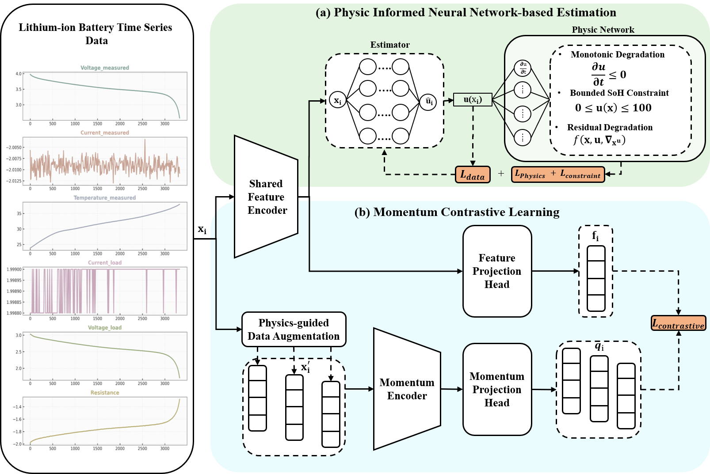

# Physics-Informed Contrastive Learning for Battery State of Health Prediction

[](https://www.python.org/downloads/)
[](https://doi.org/10.1007/s40747-025-02194-z)

Official implementation of the paper **"Physics-informed neural network and momentum contrastive learning for battery state of health estimation"** (Complex & Intelligent Systems, 2026). 

This repository provides a novel, highly efficient hybrid deep learning model that combines the interpretability of Physics-Informed Neural Networks (PINNs) with the representational power of Momentum Contrastive Learning to accurately predict the State of Health (SoH) of Lithium-ion Batteries.

## 📌 Overview

Estimating battery SoH is critical for ensuring the safe and efficient operation of Battery Management Systems (BMS) in electric vehicles (EVs) and renewable energy storage. Traditional data-driven models lack physical consistency, while purely physical models struggle with data efficiency and complex nonlinearities. 

Our architecture bridges this gap by utilizing a unified optimization strategy:
1. **Physics-Informed Neural Network-based Estimation (PINNE):** Enforces physical constraints (e.g., monotonic degradation, SEI growth, calendar aging) on the predictions.
2. **Momentum Contrastive Learning(MOCO):** Extracts robust feature representations from labeled and unlabeled time-series data.
3. **Physics-Guided Data Augmentation (PDA):** Generates realistic, physically plausible variations of electrochemical degradation patterns.

### 🚀 Key Performance Highlights
* **State-of-the-Art Accuracy:** Achieves an average Mean Absolute Error (MAE) of **0.095%** and Root Mean Squared Error (RMSE) of **0.117%** on the NASA Lithium-ion battery dataset, outperforming baselines like CNN, standard BPINN, Informer, and XGBoost-ARIMA.
* **Highly Efficient:** Lightweight architecture with only **1.96 million parameters**.
* **Production-Ready Inference:** Single-sample inference latency of **0.92s on a standard CPU** (~65.2 predictions/min), making it highly suitable for real-time resource-constrained BMS deployments.

## 🧠 Model Architecture

*(Note: We recommend placing your architecture diagrams in an `assets/` folder)*


*Figure 1: Unified architecture combining PINNE with Momentum Contrastive Learning.*

The model utilizes a Shared Feature Encoder that processes time-series data (Voltage, Current, Temperature, etc.) and explicit time-dependent sinusoidal terms. The predictions are regularized by a Physics Network that calculates residual degradation governed by real-world electrochemical dynamics.

## 📊 Dataset

We use the widely benchmarked **NASA Ames Prognostics Center of Excellence (PCoE) battery dataset**. 
* **Batteries used:** B0005, B0006, B0007, and B0018 (18650-sized Li-ion, 2Ah nominal capacity).
* **Features extracted:** Voltage, Current, Temperature, Time, State of Charge (SoC), Internal Resistance, Capacity, and Load.

## 🛠️ Getting Started

### Prerequisites
* Python 3.9+
* CUDA-compatible GPU (Recommended for training; RTX 4090 used in the paper)

### Installation
1. Clone the repository:
   ```bash
   git clone https://github.com/ingeniously/Physic_Informed_Contrastive_Learning_For_Battery_SOH_Prediction.git
   cd Physic_Informed_Contrastive_Learning_For_Battery_SOH_Prediction
   ```
2. Install the required dependencies:
   ```bash
   pip install -r requirements.txt
   ```

### Data Preparation
1. Download the [NASA Battery Dataset](https://c3.ndc.nasa.gov/dashlink/resources/133/).
2. Place the raw dataset files in the `data/raw/` directory.
3. Run the preprocessing script to extract features and generate physics-guided augmentations:
   ```bash
   python scripts/preprocess_data.py --data_dir ./data/raw --output_dir ./data/processed
   ```

### Training
To train the model from scratch using the default hyperparameters (Batch size: 512, Epochs: 500, Adam Optimizer):
```bash
python train.py --config configs/train_config.yaml
```
*Note: The unified loss function dynamically balances the data loss, physics constraints loss, and contrastive learning loss.*

### Evaluation & Inference
To evaluate a pre-trained model and generate MAE/RMSE metrics:
```bash
python evaluate.py --model_weights checkpoints/best_model.pth --test_data ./data/processed/test
```

## 📈 Results

| Battery | MAE (%) | RMSE (%) |
|---------|---------|----------|
| **B0005** | 0.1184  | 0.1374   |
| **B0006** | 0.1080  | 0.1080   |
| **B0007** | **0.0781** | **0.1026** |
| **B0018** | **0.0764** | **0.0994** |


*Figure 2: Ground truth vs. predicted SoH degradation across charge cycles, highlighting model robustness even with generated augmentations.*

## 📑 Citation

If you find this code or our paper useful in your research, please consider citing our work:

```bibtex
@article{jung2025physics,
  title={Physics-informed neural network and momentum contrastive learning for battery state of health estimation},
  author={Jung Jiwoo, and Bassole Yipene Cedric Francois and, Sung Yunsick},
  journal={Complex \& Intelligent Systems},
  volume={12},
  number={73},
  year={2026},
  publisher={Springer Nature},
  doi={10.1007/s40747-025-02194-z}
}
```

## 🤝 Contact
For technical questions or potential collaboration/recruiting inquiries, feel free to reach out via [GitHub Issues](https://github.com/ingeniously/Physic_Informed_Contrastive_Learning_For_Battery_SOH_Prediction/issues) or directly via email (see paper for details).
